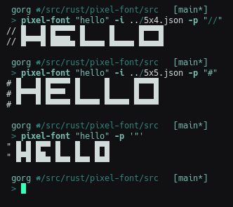

# Pixel-Font
A simple program that ouputs ascii art text to be used as comment header (using the optional prefix for your chosen comment symbols) or whatever you like!

## Screenshot


## Example Vim integration
```
function FontComment(arg)
    let l:comment = split(&commentstring, '%s')[0]
     execute "read !pixel-font '". a:arg."' -p '". l:comment. "'"
endfunction

command! -nargs=1 Fc :call FontComment("<args>")
```
